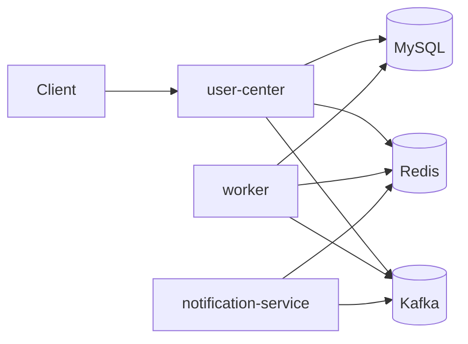

# user-center

一个基于 **Go + Gin + GORM + MySQL + Redis + Kafka** 的用户中心项目，包含邮箱注册登录、JWT 登录态、短信验证码登录、微信 OAuth 登录、签到与排行榜，以及基于 Kafka 的异步业务事件链路。

这版项目在原来的单体用户中心基础上，新增了一条**轻量服务拆分**路线：

- 主服务 `user-center` 负责同步接口与核心事务
- `worker` 负责消费 Kafka 事件并执行积分、排行榜、行为日志等异步任务
- `notification-service` 负责消费注册事件并发送欢迎消息
- Kafka 负责解耦“主流程”和“后置处理”

它还不是“大规模微服务”，但已经具备了：

- 事件驱动思维
- producer / consumer / consumer group 基础实践
- 主服务 / worker / notification-service 的职责拆分意识
- 同步主流程 + 异步后处理 的典型后端设计

---

## 1. 当前功能概览

### 用户能力
- 邮箱注册
- 邮箱密码登录
- JWT 登录态
- 登出
- 刷新 token
- 用户信息查询
- 短信验证码发送与验证码登录
- 微信 OAuth 登录

### 签到与排行
- 每日签到
- 今日是否签到查询
- 月度签到记录查询
- 连续签到天数查询
- 日榜 / 月榜查询

### Kafka 异步事件
- 用户注册成功发送 `user.registered`
- worker 消费注册事件
- 异步初始化欢迎积分
- notification-service 消费注册事件
- 异步写入欢迎消息
- 用户签到成功发送 `user.activity`
- worker 消费行为事件
- 异步更新排行榜
- 异步写入行为日志到 Redis

### 配置与工程化
- 统一配置 `AppConfig`
- `viper + yaml + env override`
- 配置热更新（动态部分）
- Zap 日志
- Wire 依赖注入
- Docker Compose 本地依赖环境
- 单元测试骨架

---

## 2. 技术栈

### Web 层
- Gin
- 自定义统一 JSON 返回结构
- JWT 中间件
- Feature Guard 中间件

### 业务层
- Service / Repository / DAO 分层
- 用户服务
- 短信验证码服务
- 签到服务
- 排行榜服务
- Kafka 事件发布

### 存储层
- MySQL 8
- GORM
- Redis
- Lua 脚本实现验证码发送/校验限流

### 异步链路
- Apache Kafka
- Sarama（Go Kafka Client）
- Consumer Group
- Worker / Notification consumers

### 工程化
- Viper 配置管理
- Zap 日志
- Wire 依赖注入
- Docker Compose 本地依赖环境

---

## 3. 项目结构

```text
user-center/
├── cmd/
│   ├── worker/                # Kafka worker 入口
│   └── notification-service/  # Kafka 通知服务入口
├── config/                    # 多环境配置文件
│   ├── dev.yaml
│   ├── worker.yaml
│   ├── notification.yaml
│   └── test.yaml
├── internal/
│   ├── config/                # 配置结构、管理器、动态配置 holder
│   ├── domain/                # 领域模型
│   ├── events/                # Kafka 事件定义、publisher
│   ├── repository/            # repository / dao / cache
│   ├── service/               # 业务服务
│   ├── web/                   # handler / jwt / middleware
│   ├── worker/                # Kafka consumer handler / 去重逻辑
│   └── notification/          # 通知服务 consumer handler
├── ioc/                       # provider，负责消费配置并初始化依赖
├── script/mysql/              # MySQL 初始化脚本
├── docker-compose.yaml        # 本地 MySQL / Redis / Kafka 环境
├── wire.go                    # Wire 注入入口
├── wire_gen.go                # Wire 生成结果
└── main.go                    # user-center 主服务入口
```

---

## 4. 服务关系图



### 你可以这样解释这张图

- `user-center` 负责处理 HTTP 请求和核心事务
- 用户注册、用户签到等主流程先快速完成
- 后续耗时/解耦逻辑通过 Kafka 投递给异步服务
- `worker` 消费事件后异步补做欢迎积分、排行榜更新、行为日志落地
- `notification-service` 消费注册事件后异步写入欢迎消息

这不是“上来就拆一堆微服务”，而是一个更适合简历和面试表达的**轻量拆分**：

> 我先把主业务服务做好，再把天然适合异步的后置动作拆到 worker 和 notification-service，用 Kafka 解耦。

---

## 5. Kafka 设计说明

### 5.1 Topic

当前项目使用两个 topic：

- `user.registered`
- `user.activity`

### 5.2 Producer

主服务里会在业务成功后发布事件：

- 注册成功后发布 `user.registered`
- 签到成功后发布 `user.activity`

### 5.3 Consumer

`cmd/worker/main.go` 启动一个 Kafka consumer group，负责消费 `user.registered` 和 `user.activity`。

`cmd/notification-service/main.go` 启动另一个独立 consumer group，负责消费 `user.registered` 并发送欢迎消息。

### 5.4 Consumer Group

默认拆成两个 consumer group：

```yaml
# worker.yaml
kafka:
  consumer_group: user-center-worker

# notification.yaml
kafka:
  consumer_group: user-center-notification-service
```

后面如果你想扩容某个服务，可以启动多个实例放到同一个 group 里。不同服务使用不同 group，这样同一条 `user.registered` 事件就能分别被 worker 和 notification-service 各消费一次。

### 5.5 Offset

当前用的是 consumer group 模式，消息成功处理后会 `MarkMessage`，Kafka 会基于 consumer group 维护消费进度。

### 5.6 幂等处理

异步消费者里加了一个基于 Redis Lua 的**原子去重器**，同时区分 done 与 processing 两种状态：

- done key：`consumer:event:done:{namespace}:{event_id}`
- processing key：`consumer:event:processing:{namespace}:{event_id}`
- done TTL：7 天
- processing TTL：5 分钟

不同服务使用不同 namespace，例如：

- `worker:user_registered`
- `notification:user_registered`

这样即使 Kafka 因为重平衡或重试导致重复投递，也不会重复加积分、重复发欢迎消息，且两个服务之间不会互相误判“已经消费过”。

---

## 6. 配置系统说明

### 6.1 配置来源

按以下顺序合并：

1. 默认值（`setDefaults`）
2. 配置文件（`config/dev.yaml` / `config/test.yaml`）
3. 环境变量覆盖（敏感项）
4. 启动参数 `--config`

### 6.2 当前支持热更新的配置

当前仅支持**部分动态配置热更新**：

- `log.level`
- `feature.*`

### 6.3 当前不会热更新、修改后需重启的配置

以下配置变更后，当前进程不会自动重建依赖：

- `server.*`
- `db.*`
- `redis.*`
- `kafka.*`
- `jwt.*`
- `wechat.*`
- `cors.*`
- `ratelimit.*`

### 6.4 关于微信登录配置校验

这里顺手修了一个配置问题：

- 以前即使 `feature.enable_wechat_login=false`，也会强制要求 `wechat.app_id/app_key` 非空
- 现在改成：**只有开启微信登录时才校验微信配置**

这更符合 feature 开关的语义。

---

## 7. 环境要求

建议本地准备：

- Go 1.25+
- Docker / Docker Compose
- MySQL 8
- Redis
- Kafka

> 由于新增了 Sarama 依赖，如果你本地是第一次拉这版代码，先执行一次 `go mod tidy`。

---

## 8. 快速开始

### 8.1 启动依赖环境

在项目根目录执行：

```bash
docker compose up -d
```

默认会启动：

- MySQL：`localhost:13316`
- Redis：`localhost:6379`
- Kafka：`localhost:9092`

### 8.2 数据库初始化

项目启动时会自动执行 GORM `AutoMigrate`。

`docker-compose` 中已挂载 `script/mysql/user.sql`，会自动创建：

```sql
CREATE DATABASE user_center;
```

如果你要跑测试配置 `config/test.yaml`，建议再手动建一个测试库：

```sql
CREATE DATABASE user_center_test;
```

### 8.3 安装依赖

```bash
go mod tidy
```

### 8.4 启动主服务

```bash
go run . --config=config/dev.yaml
```

默认监听：

```text
http://localhost:8081
```

### 8.5 启动 worker

新开一个终端执行：

```bash
go run ./cmd/worker --config=config/worker.yaml
```

如果看到类似日志，说明 worker 已经开始消费：

```text
Kafka worker 启动成功
```

### 8.6 启动 notification-service

再开一个终端执行：

```bash
go run ./cmd/notification-service --config=config/notification.yaml
```

如果看到类似日志，说明通知服务已经开始消费：

```text
Kafka notification-service 启动成功
```

---

## 9. 核心配置项

### Kafka

```yaml
# 主服务 dev.yaml
kafka:
  enabled: true
  brokers:
    - localhost:9092
  client_id: user-center

# worker.yaml
kafka:
  enabled: true
  brokers:
    - localhost:9092
  client_id: user-center-worker
  consumer_group: user-center-worker

# notification.yaml
kafka:
  enabled: true
  brokers:
    - localhost:9092
  client_id: user-center-notification-service
  consumer_group: user-center-notification-service
```

### 当你不想启用 Kafka 时

你可以临时把开发配置改成：

```yaml
kafka:
  enabled: false
```

这时：

- 主服务仍可启动
- 注册事件不会投递
- 签到会回退成**同步更新排行榜 + 同步写行为日志**
- worker 不应启动

---

## 10. 异步业务事件说明

### 10.1 注册事件：`user.registered`

主服务注册成功后会先把事件写入 MySQL outbox，再由 relay 异步投递到 Kafka：

```json
{
  "event_id": "uuid",
  "type": "user.registered",
  "user_id": 123,
  "email": "123@qq.com",
  "occurred_at": 1710000000000
}
```

异步链路拆成两段：

- `worker` 消费后给新用户初始化欢迎积分（默认 20 分）
- `notification-service` 消费后异步写入欢迎消息到 Redis：`welcome:message:user:{user_id}`
- 使用 MySQL outbox + 存储层幂等 + Redis 原子去重（done/processing）做保护

### 10.2 行为事件：`user.activity`

当前先落地了签到行为：

```json
{
  "event_id": "uuid",
  "type": "user.activity",
  "user_id": 123,
  "action": "checkin",
  "biz_id": "20260410",
  "points": 5,
  "occurred_at": 1710000000000
}
```

worker 消费后：

- 异步更新排行榜
- 异步写入行为日志到 Redis 列表

Redis 行为日志 key 示例：

```text
activity:log:user:123
```

---

## 11. 手动验证流程

### 11.1 注册并触发 `user.registered`

```bash
curl -X POST http://localhost:8081/user/signup \
  -H "Content-Type: application/json" \
  -d '{"email":"kafka-demo@qq.com","password":"Hello@123","confirmed_password":"Hello@123"}'
```

如果 worker 正常运行，你可以到 MySQL 里查欢迎积分流水：

```sql
SELECT * FROM user_point_record_of_dbs WHERE biz_type = 'welcome';
```

> 表名如果你本地 GORM 命名策略不同，以实际表名为准；核心是查 `biz_type='welcome'`。

如果 notification-service 正常运行，你也可以到 Redis 里查欢迎消息：

```bash
docker compose exec redis redis-cli GET welcome:message:user:1
```

### 11.2 登录拿 token

```bash
curl -X POST http://localhost:8081/user/login \
  -H "Content-Type: application/json" \
  -d '{"email":"kafka-demo@qq.com","password":"Hello@123"}' -i
```

从响应头取：

```text
x-jwt-token
```

### 11.3 签到并触发 `user.activity`

```bash
curl -X POST http://localhost:8081/checkin \
  -H "Authorization: Bearer 你的token"
```

### 11.4 查看行为日志是否写入 Redis

```bash
docker compose exec redis redis-cli -n 1 LRANGE activity:log:user:1 0 -1
```

### 11.5 查看排行榜是否被异步更新

```bash
curl http://localhost:8081/rank/daily
curl http://localhost:8081/rank/monthly
```

---

## 12. 面试里可以怎么讲

### 12.1 为什么要加 Kafka

因为有些逻辑不适合阻塞在主请求里，比如：

- 注册成功后的欢迎积分初始化与欢迎消息写入
- 行为事件记录
- 排行榜更新

这些逻辑天然适合异步化。

### 12.2 为什么这不算“大规模微服务”

因为我没有为了拆而拆：

- 核心业务仍然集中在 `user-center`
- 只把明显适合异步的后置逻辑拆给 `worker` 和 `notification-service`
- 这两个服务仍然围绕同一个业务域协作，不涉及复杂的服务治理、注册发现、链路追踪和跨团队边界
- 拆分目标是**解耦与演示工程能力**，不是追求服务数量

### 12.3 这版实现的亮点

- Kafka 基本概念落地：topic / producer / consumer / consumer group / offset
- Go 接 Kafka：Sarama producer + consumer group
- 业务事件设计：注册事件 + 行为事件
- 轻量服务拆分：主服务 + worker + notification-service
- 一致性增强：MySQL outbox + relay 异步投递 Kafka
- 幂等保护：Redis 原子去重 + 存储层幂等
- 降级策略：Kafka 关闭时，签到回退为同步更新排行榜和行为日志

---

## 13. 后续还能继续补什么

如果你后面还想继续拉高这个项目，可以按下面方向继续迭代：

1. 把欢迎消息从 Redis 升级成真正的站内信 / 邮件 / 短信发送渠道
2. 把行为日志从 Redis list 升级成 Kafka 下游专门处理
3. 给 Kafka 增加死信队列 / 重试策略
4. 增加后台管理接口，查询行为日志与积分流水
5. 给 outbox relay 增加监控、告警和后台补偿能力

---

## 14. 一句话总结

这版 `user-center` 已经不是单纯的 CRUD 用户中心了，而是一个：

> **具备配置化、缓存、鉴权、签到排行、Kafka 异步解耦、轻量服务拆分意识的 Go 后端项目。**
