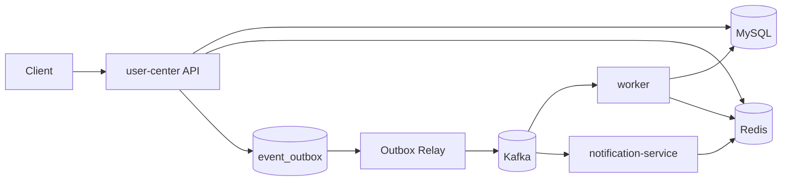

# user-center

一个基于 Go、Gin、GORM、MySQL、Redis 和 Kafka 的用户中心后端。当前仓库是 `community-v1` 演进前的 backend-only baseline，不包含外部智能服务。

## 当前能力

- 邮箱注册、邮箱密码登录、退出与 access/refresh token 刷新。
- 短信验证码发送与登录；微信 OAuth 登录受 feature flag 控制。
- 用户资料查询与修改。
- 每日签到、月度签到记录、连续签到天数。
- 日榜、月榜及个人排名查询。
- MySQL Outbox、Kafka Relay、两个 Consumer Group。
- 注册后异步发放欢迎积分并在 Redis 保存欢迎消息。
- 签到后异步写入 Redis 行为日志并更新日榜、月榜。
- Redis Lua 消费去重，以及数据库唯一约束提供的业务幂等保护。
- Viper 配置、环境变量覆盖、Zap 日志、Wire 依赖注入。

## 运行架构


```mermaid
flowchart LR
    Client --> API[user-center API]
    API --> MySQL[(MySQL)]
    API --> Redis[(Redis)]
    API --> Outbox[(event_outbox)]
    Outbox --> Relay[Outbox Relay]
    Relay --> Kafka[(Kafka)]
    Kafka --> Worker[worker]
    Kafka --> Notification[notification-service]
    Worker --> MySQL
    Worker --> Redis
    Notification --> Redis
```

- `user-center` 处理 HTTP 请求与核心数据库事务，并在同一事务中写入 Outbox。
- Relay 轮询待发布记录，发送成功后把记录标记为 `published`。
- `worker` 消费注册和用户行为事件。
- `notification-service` 消费注册事件；当前“通知”是 Redis 中的欢迎消息，不是邮件或短信发送。

## 核心业务链路

### Signup

```text
POST /user/signup
  -> MySQL user
  -> event_outbox: user.registered
  -> Relay -> Kafka
  -> worker: welcome points
  -> notification-service: Redis welcome message
```

### Login 与 Checkin

```text
POST /user/login
  -> x-jwt-token / x-refresh-token
POST /checkin
  -> MySQL sign-in record + sign-in points
  -> event_outbox: user.activity
  -> Relay -> Kafka -> worker
  -> Redis activity log + daily/monthly rank
```

当 `kafka.enabled=false` 时，主服务不会写 Kafka Outbox 事件；签到的排行榜与行为日志后置动作会在主服务中同步执行。worker 和 notification-service 要求 Kafka 开启。

## Kafka

| Topic | Producer | Consumer group | 当前处理 |
|---|---|---|---|
| `user.registered` | user-center Outbox Relay | `user-center-worker` | 欢迎积分 |
| `user.registered` | user-center Outbox Relay | `user-center-notification-service` | Redis 欢迎消息 |
| `user.activity` | user-center Outbox Relay | `user-center-worker` | 行为日志与签到排行 |

Sarama producer 使用 `WaitForAll`，Relay 按 at-least-once 语义工作。Consumer handler 成功返回后才提交消息；消费者必须按可能重复投递设计。

代码中存在 retry/DLQ 相关原型与 DLQ topic 创建逻辑，但当前 consumer 入口没有组合这些 handler，因此不能描述为已接入重试或 DLQ。

## Redis Key

| Key | 类型 | 用途 |
|---|---|---|
| `user:refresh:ssid:{ssid}` | String | refresh session/JTI |
| `sign:{user_id}:{yyyy}:{mm}` | Bitmap | 月度签到日期缓存 |
| `consumer:event:processing:{namespace}:{event_id}` | String | 消费处理中去重标记 |
| `consumer:event:done:{namespace}:{event_id}` | String | 消费完成去重标记 |
| `worker:event:done:{event_id}` | String | 用户行为事件完成标记 |
| `activity:log:user:{user_id}` | List | 最近用户行为，最多 100 条 |
| `rank:active:daily:{yyyyMMdd}` | ZSet | 日榜 |
| `rank:active:monthly:{yyyyMM}` | ZSet | 月榜 |
| `welcome:message:user:{user_id}` | String/JSON | 当前欢迎通知 |

Redis 使用 DB 1。

## 项目结构

```text
.
├── cmd/
│   ├── worker/
│   ├── notification-service/
│   └── compensate-job/
├── config/
├── internal/
│   ├── config/
│   ├── domain/
│   ├── events/
│   ├── notification/
│   ├── repository/
│   ├── service/
│   ├── web/
│   └── worker/
├── ioc/
├── pkg/
├── script/
├── docs/community-dev/
├── docker-compose.yaml
├── wire.go
└── wire_gen.go
```

`cmd/compensate-job` 目前只是可编译的实验入口，`runCompensate` 仍是 no-op；它不属于已完成的补偿能力。

## 本地运行

要求：Go 1.25+、Docker Desktop 或 Docker Engine、Docker Compose。

复制环境变量示例并替换所有 `REPLACE_ME`：

```powershell
Copy-Item .env.example .env
```

标准本地运行方式：

```bash
docker compose up -d --build
docker compose ps
```

Compose 内部服务通过 `kafka:9092` 连接 Kafka；宿主机直接运行 Go 服务时，开发配置通过 `localhost:29092` 连接 Compose 暴露的 Kafka listener。

也可以在依赖容器启动后，从宿主机分别运行：

```bash
go run . --config=config/dev.yaml
go run ./cmd/worker --config=config/worker.yaml
go run ./cmd/notification-service --config=config/notification.yaml
```

主服务监听 `http://localhost:8081`。数据库由启动时的 GORM `AutoMigrate` 初始化。

## 验证

```bash
go build ./...
go test ./...
go vet ./...
go test -race ./...
git diff --check
```

Windows 上运行 race detector 需要启用 CGO 并安装 C 编译器；也可以在带有编译器的 Go Linux 环境中执行。

## 当前边界

- 没有已接入的 Kafka 延迟重试或 DLQ 消费链路。
- 没有账号级登录限流；当前 HTTP 限流是配置驱动的全局 Redis 滑动窗口。
- `RankConsistencyCache` 和补偿服务代码没有接入运行时依赖图。
- 没有可声明的 QPS、P95/P99 或缓存命中率基准结果。
- Outbox Relay 当前没有多实例抢占保护与退避策略。

后续增量开发规范见 [docs/community-dev](docs/community-dev/)；项目边界见 [PROJECT_BOUNDARY.md](docs/community-dev/PROJECT_BOUNDARY.md)。
