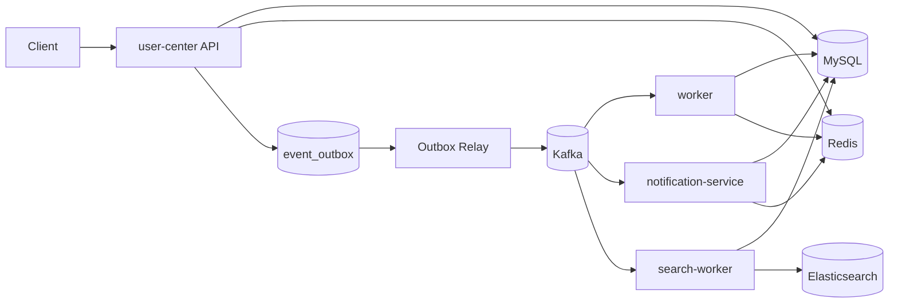

# user-center

一个基于 Go、Gin、GORM、MySQL、Redis、Kafka 和 Elasticsearch 的生活图文社区后端。当前仓库是完成 M01–M11 的 `community-v1`，不包含外部智能服务。

## 当前能力

- 邮箱注册、邮箱密码登录、退出与 access/refresh token 刷新。
- 短信验证码发送与登录；微信 OAuth 登录受 feature flag 控制。
- 用户资料查询与修改。
- 用户关注、取消关注，以及粉丝/关注列表的稳定 cursor 分页。关系保存在 MySQL，本阶段不加 Redis。
- 多图笔记发布、详情、作者列表和软删除。发布与 `note.published` Outbox 写入同一 MySQL 事务。
- 笔记详情使用 1 秒有界本地缓存、Redis 正/负缓存、TTL jitter 和进程内 singleflight；Redis 故障时回源 MySQL。
- 笔记点赞/取消点赞、评论发布与时间序 cursor 分页。首次点赞和评论写入 Outbox。
- 关注 Feed（Hybrid）：普通作者 `note.published` 扇出到 Redis Inbox；follower 数达到 `feed.fanout_threshold` 的作者改走 Pull。`GET /feed/following` 按 `note_id` 合并 Inbox 与大 V 近况。
- 内容热榜：worker 将 publish/like/comment 聚合到 Redis 分钟桶；`GET /rank/hot` 使用 60 分钟物化 snapshot 稳定分页。
- 笔记全文搜索：独立 search worker 将 `note.published` / `note.deleted` 投影到 Elasticsearch；`GET /search/notes?q=...` 在 ES 失败时执行最近 30 天、最多 20 条、300ms 超时的 MySQL 有界降级。
- 社区通知：`user.followed`、`note.liked`、`comment.created` 由 notification-service 消费并幂等落 MySQL；支持当前用户通知列表的稳定 cursor 分页和幂等已读。
- 每日签到、月度签到记录、连续签到天数。
- 日榜、月榜及个人排名查询。
- MySQL Outbox、Kafka Relay、三个 Consumer Group。
- 注册后异步发放欢迎积分并在 Redis 保存欢迎消息。
- 签到后异步写入 Redis 行为日志并更新日榜、月榜。
- Redis Lua 消费去重，以及数据库唯一约束提供的业务幂等保护。
- Viper 配置、环境变量覆盖、Zap 日志、Wire 依赖注入。

## 运行架构


```mermaid
flowchart LR
    Client --> API[user-center API]
    API --> MySQL[(MySQL)]
    API --> Redis[(Redis)]
    API --> Outbox[(event_outbox)]
    Outbox --> Relay[Outbox Relay]
    Relay --> Kafka[(Kafka)]
    Kafka --> Worker[worker]
    Kafka --> Notification[notification-service]
    Kafka --> SearchWorker[search-worker]
    Worker --> MySQL
    Worker --> Redis
    Notification --> MySQL
    Notification --> Redis
    SearchWorker --> MySQL
    SearchWorker --> ES[(Elasticsearch)]
```

- `user-center` 处理 HTTP 请求与核心数据库事务，并在同一事务中写入 Outbox。
- Relay 轮询待发布记录，发送成功后把记录标记为 `published`。
- `worker` 消费注册、用户行为和 `note.published` 扇出事件。
- `notification-service` 消费注册、关注、点赞和评论事件；欢迎消息保留在 Redis，社区通知以 MySQL 为真相源，不包含邮件、短信或移动推送。
- `search-worker` 使用独立 consumer group，把笔记事件投影到可重建的 Elasticsearch 索引；ES 不是真相源。

## 核心业务链路

### Signup

```text
POST /user/signup
  -> MySQL user
  -> event_outbox: user.registered
  -> Relay -> Kafka
  -> worker: welcome points
  -> notification-service: Redis welcome message
```

### Login 与 Checkin

```text
POST /user/login
  -> x-jwt-token / x-refresh-token
POST /checkin
  -> MySQL sign-in record + sign-in points
  -> event_outbox: user.activity
  -> Relay -> Kafka -> worker
  -> Redis activity log + daily/monthly rank
```

当 `kafka.enabled=false` 时，主服务不会写 Kafka Outbox 事件；签到的排行榜与行为日志后置动作会在主服务中同步执行。worker 和 notification-service 要求 Kafka 开启。

## Kafka

| Topic | Producer | Consumer group | 当前处理 |
|---|---|---|---|
| `user.registered` | user-center Outbox Relay | `user-center-worker` | 欢迎积分 |
| `user.registered` | user-center Outbox Relay | `user-center-notification-service` | Redis 欢迎消息 |
| `user.followed` | user-center Outbox Relay | `user-center-notification-service` | MySQL 关注通知 |
| `user.activity` | user-center Outbox Relay | `user-center-worker` | 行为日志与签到排行 |
| `note.published` | user-center Outbox Relay | `user-center-worker` | Feed fanout/skip + Hot Ranking |
| `note.published` | user-center Outbox Relay | `user-center-search-worker` | 写入笔记搜索索引 |
| `note.deleted` | user-center Outbox Relay | `user-center-search-worker` | 删除笔记搜索文档 |
| `note.liked` | user-center Outbox Relay | `user-center-worker` | Hot Ranking 加权聚合 |
| `note.liked` | user-center Outbox Relay | `user-center-notification-service` | MySQL 点赞通知 |
| `comment.created` | user-center Outbox Relay | `user-center-worker` | Hot Ranking 加权聚合 |
| `comment.created` | user-center Outbox Relay | `user-center-notification-service` | MySQL 评论通知 |

Sarama producer 使用 `WaitForAll`，Relay 按 at-least-once 语义工作。Consumer handler 成功返回后才提交消息；消费者必须按可能重复投递设计。

永久非法 JSON/event 只有在同步写入其 `.dlq` topic 成功后才提交原 offset；Redis/MySQL/ES/timeout 与正在处理中的 lease 都保持原消息未提交，等待 Kafka redelivery。项目不使用消息 timestamp 模拟延迟重试。

## Redis Key

| Key | 类型 | 用途 |
|---|---|---|
| `user:refresh:ssid:{ssid}` | String | refresh session/JTI |
| `sign:{user_id}:{yyyy}:{mm}` | Bitmap | 月度签到日期缓存 |
| `consumer:event:processing:{namespace}:{event_id}` | String | 消费处理中去重标记 |
| `consumer:event:done:{namespace}:{event_id}` | String | 消费完成去重标记 |
| `worker:event:done:{event_id}` | String | 用户行为事件完成标记 |
| `activity:log:user:{user_id}` | List | 最近用户行为，最多 100 条 |
| `rank:active:daily:{yyyyMMdd}` | ZSet | 日榜 |
| `rank:active:monthly:{yyyyMM}` | ZSet | 月榜 |
| `welcome:message:user:{user_id}` | String/JSON | 当前欢迎通知 |
| `feed:inbox:{user_id}` | ZSet | Following Feed Inbox，member/score 均为 note_id |
| `note:detail:{note_id}` | String/JSON | 笔记详情正缓存或 not-found tombstone |
| `hot:note:{yyyyMMddHHmm}` | ZSet | 内容热榜分钟桶 |
| `hot:event:done:{event_id}` | String | 热榜事件原子去重 |
| `hot:note:snapshot:{unix_minute}` | ZSet | 热榜稳定分页快照 |

Redis 使用 DB 1。

## 项目结构

```text
.
├── cmd/
│   ├── worker/
│   ├── notification-service/
│   ├── search-worker/
│   └── search-reindex/
├── config/
├── internal/
│   ├── config/
│   ├── domain/
│   ├── events/
│   ├── notification/
│   ├── repository/
│   ├── service/
│   ├── web/
│   └── worker/
├── ioc/
├── pkg/
├── script/
├── docs/community-dev/
├── docker-compose.yaml
├── wire.go
└── wire_gen.go
```

## 本地运行

要求：Go 1.25+、Docker Desktop 或 Docker Engine、Docker Compose。

复制环境变量示例并替换所有 `REPLACE_ME`。`MYSQL_ROOT_PASSWORD` 与 `DB_DSN` 中的密码必须保持一致；release 配置会拒绝空值、placeholder 和 dummy JWT 密钥：

```powershell
Copy-Item .env.example .env
```

标准本地运行方式：

```bash
docker compose up -d --build
docker compose ps
```

Compose 内部服务通过 `kafka:9092` 连接 Kafka；宿主机直接运行 Go 服务时，开发配置通过 `localhost:29092` 连接 Compose 暴露的 Kafka listener。

也可以在依赖容器启动后，从宿主机分别运行：

```bash
go run . --config=config/dev.yaml
go run ./cmd/worker --config=config/worker.yaml
go run ./cmd/notification-service --config=config/notification.yaml
go run ./cmd/search-worker --config=config/worker.yaml
```

主服务监听 `http://localhost:8081`。数据库由启动时的 GORM `AutoMigrate` 初始化。

Elasticsearch 索引是派生数据，可从 MySQL 重建：

```bash
go run ./cmd/search-reindex --config=config/worker.yaml
```

## 验证

```bash
go build ./...
go test ./...
go vet ./...
go test -race ./...
git diff --check
```

Windows 上运行 race detector 需要启用 CGO 并安装 C 编译器；也可以在带有编译器的 Go Linux 环境中执行。

M11 保存了可重复执行的 Note cache、Feed、Outbox/Kafka 和 Search 对照，以及故障矩阵。数值仅代表记录中的本机、fixture 和命令，不应外推为生产 QPS/P95/P99：

- [Community V1 benchmark evidence](docs/community-dev/benchmarks/2026-09-08-m11-community-v1.md)
- [Failure matrix](docs/community-dev/17_FAILURE_MATRIX.md)

## 当前边界

- 没有 retry topic 或 broker 延迟重试；当前仅实现永久错误到 DLQ 的可靠转移。
- 没有账号级登录限流；当前 HTTP 限流是配置驱动的全局 Redis 滑动窗口。
- `RankConsistencyCache` 没有接入运行时依赖图。
- M07 仅有受控 DAO harness 的 singleflight ON/OFF 回源对照；没有可声明的生产 QPS、P95/P99 或缓存命中率。
- Outbox Relay 当前没有多实例抢占保护与退避策略。
- 当前没有笔记更新 API，因此没有 `note.updated` producer；不得把 Elasticsearch 文档覆盖能力描述为已上线的业务更新链路。
- 社区通知当前只有站内 MySQL 列表与已读状态；没有未读数缓存、聚合通知、邮件/短信/移动推送。

后续增量开发规范见 [docs/community-dev](docs/community-dev/)；项目边界见 [PROJECT_BOUNDARY.md](docs/community-dev/PROJECT_BOUNDARY.md)。
