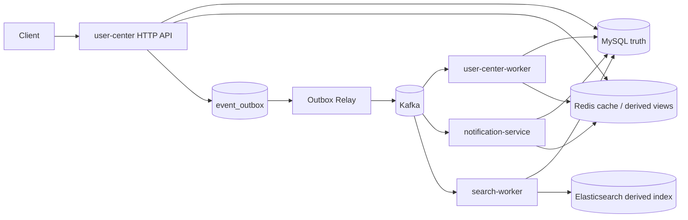

# Community V1 Runtime Architecture

## 运行拓扑



## 同步调用链

```text
Gin handler → service/use-case → repository → DAO / Redis / Elasticsearch adapter
```

- Handler 负责 HTTP DTO、认证上下文和错误映射。
- Service 负责业务规则、事务边界、cursor 与降级边界。
- Repository 隔离 domain 与持久化模型。
- DAO/Integration 承担 GORM、Redis、Elasticsearch 协议细节。
- Wire 与 `ioc/` 只装配依赖，不承载业务规则。

## 异步调用链

```text
service transaction
  → business row + event_outbox
  → relay sync produce (WaitForAll)
  → Kafka consumer group
  → consumer handler
  → service/repository
  → MySQL or Redis derived state
```

该链路是 at-least-once，不是 exactly-once。Kafka 已确认但 Outbox 尚未标记 published 的崩溃窗口会产生重复消息，因此消费者依赖 Redis 原子去重、固定 ES document ID 或 MySQL 唯一键实现幂等。

## 数据真相与派生数据

| 能力 | 真相源 | 派生/加速 |
|---|---|---|
| 用户、签到、积分 | MySQL | Redis session、bitmap、rank、activity log |
| Follow、Note、Like、Comment | MySQL | Redis Feed inbox、Note cache、Hot rank |
| Community notification | MySQL `notifications` | 无缓存 |
| Search | MySQL `notes` | Elasticsearch `community_notes` |
| 可靠事件 | MySQL `event_outbox` | Kafka transport |

## 进程职责

| Process | Responsibility | Consumer group |
|---|---|---|
| `user-center` | HTTP、业务事务、Outbox Relay | 不适用 |
| `worker` | welcome points、activity/rank、Feed fanout、Hot Ranking | `user-center-worker` |
| `notification-service` | Redis welcome message、MySQL community notification | `user-center-notification-service` |
| `search-worker` | Note 事件投影到 Elasticsearch | `user-center-search-worker` |
| `search-reindex` | 从 MySQL 重建 ES published note index | 不适用 |

## 明确边界

- 没有接入 consumer retry topic 或 DLQ handler；代码中的原型不属于运行链路。
- Outbox Relay 没有多实例 claim/lease，多个 Relay 同时扫描可能重复发送并发生标记竞争。
- Redis/ES 故障不会改变 MySQL 真相；部分读路径会降级，异步派生路径等待恢复后重投。
- 没有 Prometheus/Grafana、Kubernetes、服务发现或分布式事务框架。
- AI/RAG 不在本仓库运行边界内。
